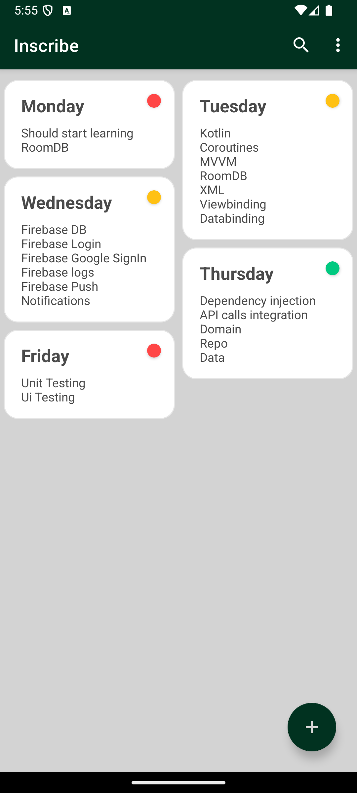
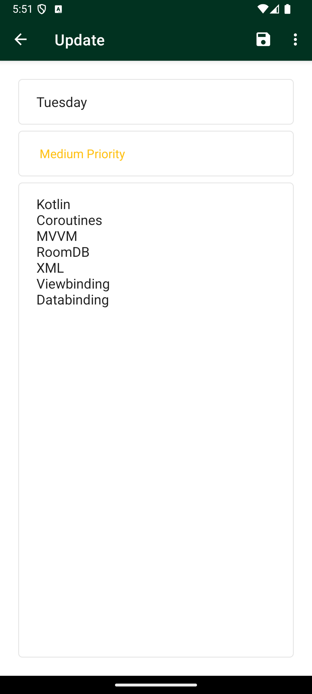
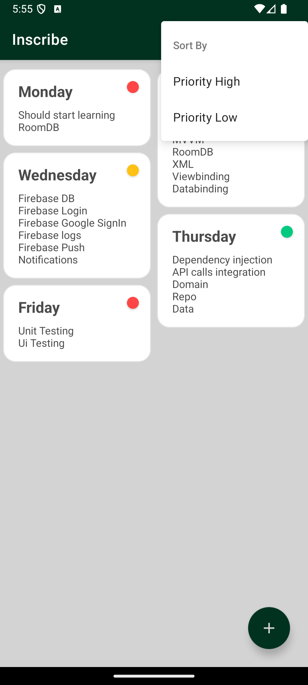
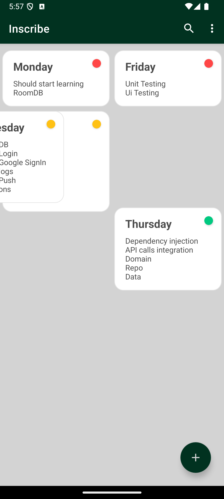
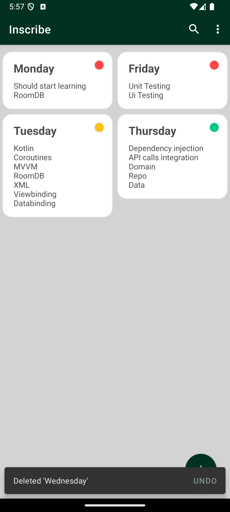

# Inscribe
A To-Do application developed in Kotlin with CRUD operations using RoomDB, which include undo functionality. 

Kotlin - MVVM - RoomDB - Data Binding - Jetpack Navigation

## App Screenshot
  
  
  
